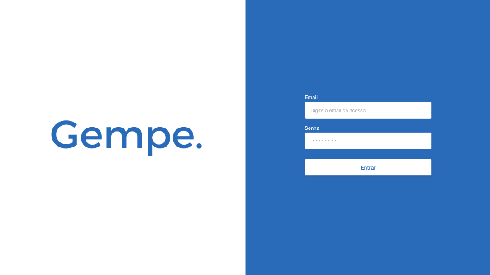
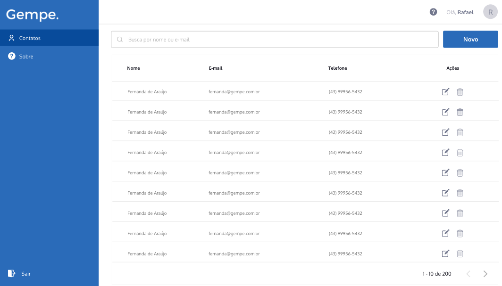
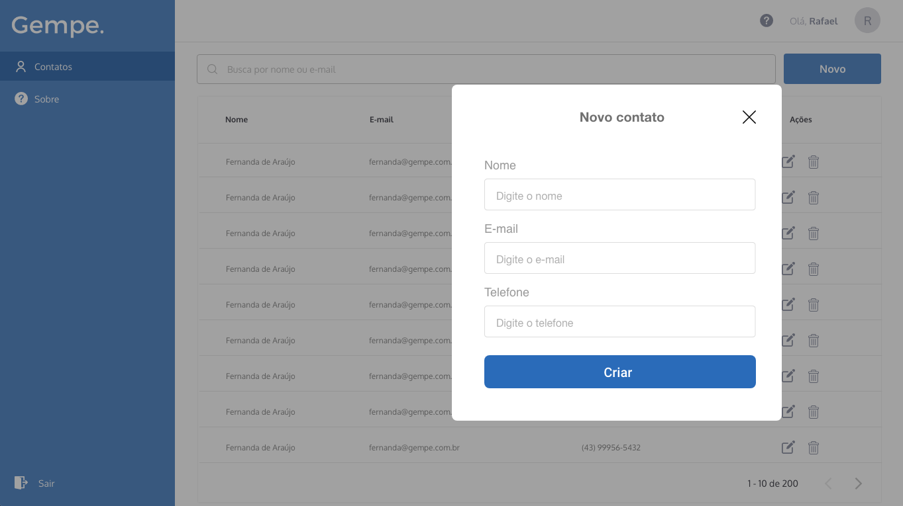
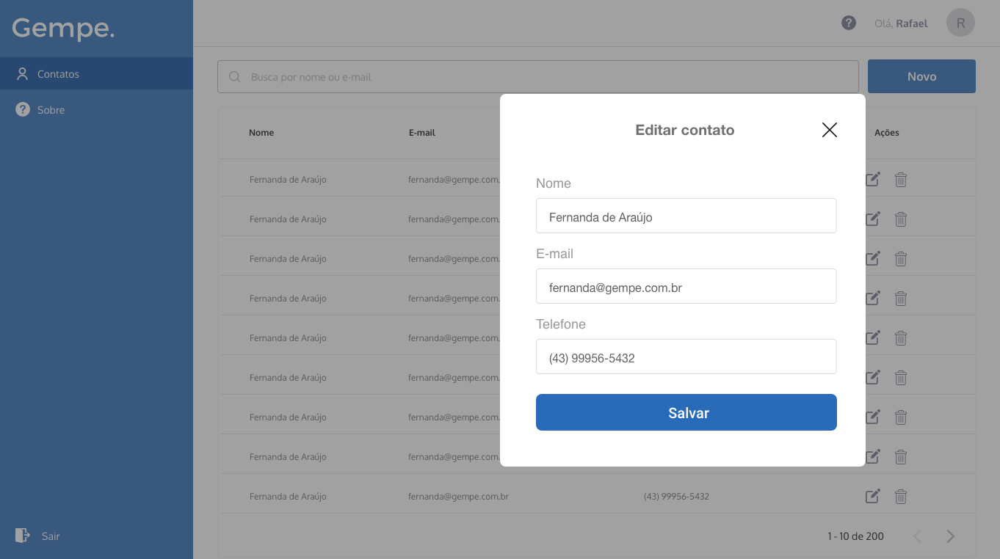
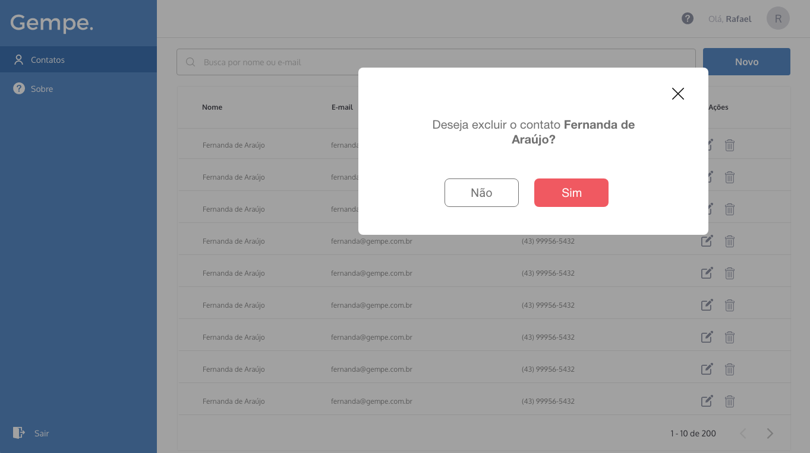

# Teste Fullstack Gempe

Leia todo o projeto, faça sua estimativa de horas para o desenvolvimento e envie um email com o título `Seu Nome | Estimativa Teste Fullstack` para 
rafael@gempe.com.br

Ao finalizar o teste, publique tudo no seu [Github](https://github.com)  e envie um email com o link do repositório para rafael@gempe.com.br

## Objetivos backend

Desenvolver uma **API JSON RESTful** em **Node**, que utilize os métodos (`GET`, `POST`, `PUT`, `DELETE`).

Rode a **API** com Docker e Docker Compose (Bônus :star:)

### Especificação

Monte uma base de contatos com a seguinte estrutura:

```
name:       string
email:      string
phone:      string
createdAt:  datetime
updatedAt:  datetime
```

Utilize **MongoDB** ou **Postgres** para armazenar os dados que a **API** irá consumir.

### Recursos da API

`GET /people`

Retorna todos os contatos

---

`GET /people?q=`

Retorna os contatos filtrando por nome e e-mail de acordo com o termo passado parâmetro `q`

---

`GET /people/{id}`

Retorna detalhes de um contato específico

---

`POST /people`

Adiciona um contato

---

`PUT /people/{id}`

Atualiza os dados de um contato

---

`DELETE /people/{id}`

Apaga o contato


## Objetivos frontend

Desenvolver a **UI (User Interface)** em **Angular** com base no [Protótipo Adobe XD](https://xd.adobe.com/view/6f79ce99-bcc0-41d6-8729-83b9fc6e90aa-3a2a/) :

- tela de listagem/busca
- tela de edição/novo

Rode a **Aplicação** com Docker e Docker Compose (Bônus :star:)
Utilize [NGXS](https://www.ngxs.io/)  para gerenciamento de estado na **Aplicação** (Bônus :star:)

### Especificação

- Consumir **API** criada acima

- Tela de login



- Tela de contatos com AuthGuard (apenas usuários autenticados podem acessar)

- Listagem de contatos com busca e paginação



- Criar um contato



- Editar um contato



- Excluir um contato



### Dicas

Utilize um framework para auxiliar no desenvolvimento das interfaces, como por exemplo:

- https://ng.ant.design/
- https://ng-bootstrap.github.io/
- https://material.angular.io/

## Dúvidas

Qualquer dúvida sobre esse teste, envie um email com o título `Dúvida | Teste Fullstack Gempe` para rafael@gempe.com.br